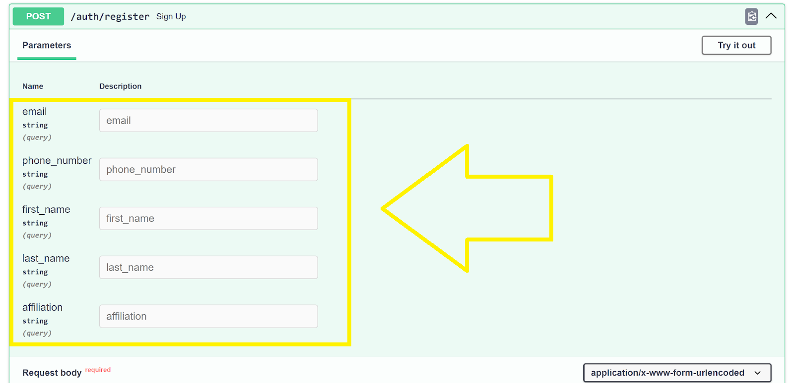
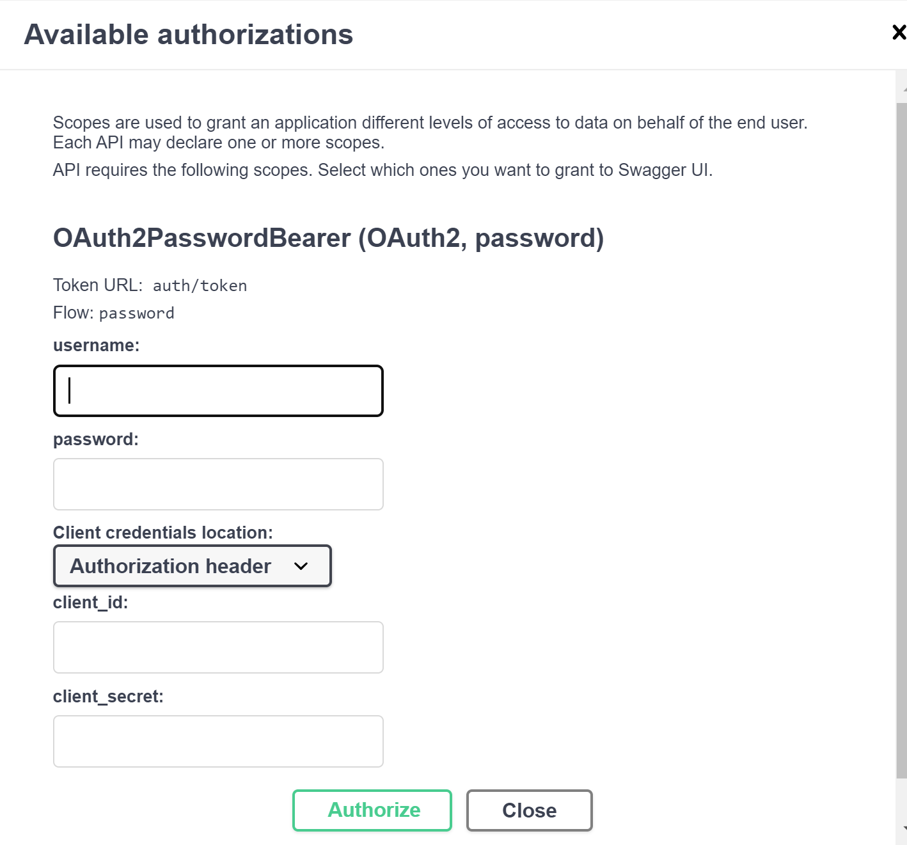

# Getting Started - Authorization to Access Data

#### This guide is for the authorization process to use the Jupyter Notebook, which is needed to access the cognitive assessment data. It outlines the steps that need to be completed by each team member who plans to pull this data. Before following this guide, you should have your cognitive assessments 'plugged in' into your chosen platform and test that these display properly. 

**If you are an external collaborator outside of PSU and you have yet to contact us, please reach out to us immediately at m2c2@psu.edu and do not proceed.**  

* Go to this URL: [https://prod.m2c2kit.com/docs#/authentication/sign_up_auth_register_post](https://prod.m2c2kit.com/docs#/authentication/sign_up_auth_register_post)  

* Click ‘Try it out’  

* Fill out the fields:  
   email  
   phone_number  
   first_name  
   last_name  
   affiliation  
   username  
   password    
   (Leave grant_type, scope, client_id, and client_secret blank)

* Select 'Execute' (big blue button). 

* If successful, you will see 'Responses' below the blue 'Execute' button. 

* Select 'Execute' (big blue button). 

.")

* If successful, you will see 'Responses' below the blue 'Execute' button. 

* Contact our team to add the study name to our system by filling out this study form: **[Authorization Study Creation Request Form](https://airtable.com/app0JQhjqc5VNZMpZ/shrAqgkD5GD3hHOKI)**  **IMPORTANT:** This form only has to be completed *ONCE* for your study. Skip this step and the next step if a team member has already completed this form.

* Wait for us to confirm that the study has been successfully created. (Again, skip this step if a team member has already completed the above form)
* Once you have been confirmed to have been authorized and the study has been added, click ‘Authorize’ located at the very top of the form (https://prod.m2c2kit.com/docs#/) and input your username and password.  

* Once this is confirmed, close this pop-up window.  

* Next, go to whoami endpoint (located under authentication) and expand the window by hitting the down arrow. This will expose more content.
   
* Click on ‘try it out’ in the top-right-hand corner.

* Then, select ‘Execute’. 

* Your information will be displayed below (see example)

")

* Next, fill out our Airtable form to capture details about who should be allowed to pull data: **[Usernames for Data Access Form](https://airtable.com/app0JQhjqc5VNZMpZ/shr2FrUEAeaZV7RzF)**.
* You are now ready to use the Jupyter Notebook:  \
 \
[https://github.com/m2c2-project/m2c2kit-integration-guides/blob/main/jupyter_notebooks/M2C2Kit_Data_Query_Notebook.ipynb](https://github.com/m2c2-project/m2c2kit-integration-guides/blob/main/jupyter_notebooks/M2C2Kit_Data_Query_Notebook.ipynb)  

    * Follow the guide and download the Jupyter Notebook from the GitHub repo to use on your device.  

Questions? Please submit the **[Question Form](https://airtable.com/app0JQhjqc5VNZMpZ/shrFeHYs7coh4FEni)**. Although the Question Form is the fastest way to alert us, you may also reach us at m2c2@psu.edu. 
